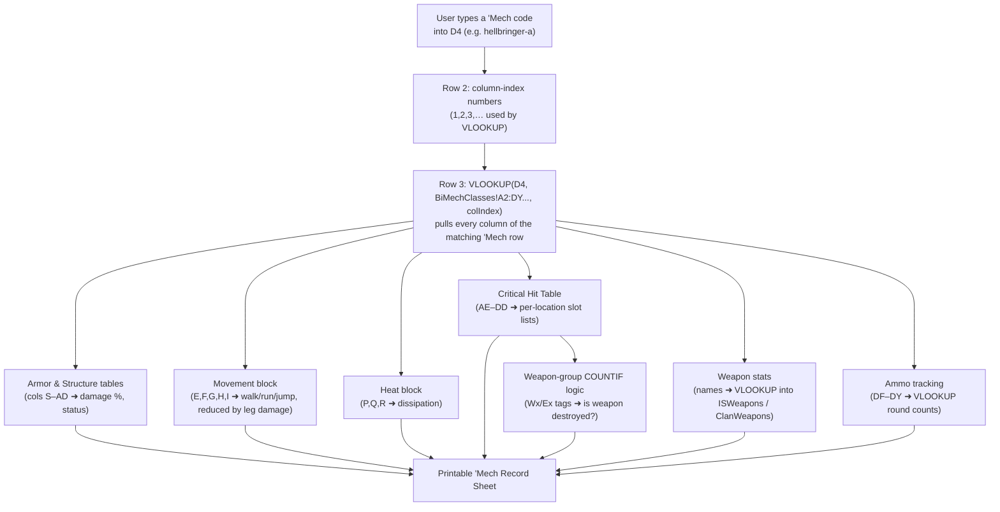

# `BiMechClasses` Sheet — Column & Data Model Reference

This document explains the `BiMechClasses` worksheet inside `data/catalog/source/mechsheet.xls`, how each
column maps to a BattleTech `'Mech`, and how the data flows into the printable **'Mech Record
Sheet** tab (`Enemy One 100%`). The reference sheet [Data/R.jpg](Data/R.jpg) shows a completed
record sheet (a *Champion CHP‑4C*) and is used throughout as the visual cross‑reference.

---

## 1. Mental model: what a `'Mech` is

A BattleMech is a humanoid war machine. Every `'Mech` is built from a fixed anatomy, and the
game divides that anatomy into **8 locations**:

| Location | Sheet code | Critical‑slot columns | # slots |
|----------|-----------|------------------------|---------|
| Head | `HD` | `HD01`–`HD06` | 6 |
| Center Torso | `CT` | `CT01`–`CT12` | 12 |
| Right Torso | `RT` | `RT01`–`RT12` | 12 |
| Left Torso | `LT` | `LT01`–`LT12` | 12 |
| Right Arm | `RA` | `RA01`–`RA12` | 12 |
| Left Arm | `LA` | `LA01`–`LA12` | 12 |
| Right Leg | `RL` | `RL01`–`RL06` | 6 |
| Left Leg | `LL` | `LL01`–`LL06` | 6 |

Each location has three attributes that the sheet stores separately:

1. **Internal Structure** — the skeleton (how much damage the location absorbs after armor is gone).
2. **Armor** — the protective plating layered on top of the structure.
3. **Critical slots** — the numbered equipment bays that hold engine parts, actuators, weapons,
   heat sinks, ammo, and other modules.

One **row = one `'Mech` variant**. Row 1 holds the column headers; every row from 2 down is a
complete, pre‑built `'Mech` design (the workbook ships with ~620 designs).

---

## 2. How the columns are organized

The 129 columns fall into seven logical blocks, left to right:

```
A–N     Identity & manufacturer metadata
O       Tonnage (the master weight number)
P–R     Heat sinks
S–Y     Armor points per location
Z–AD    Internal structure points per location
AE–DD   Critical‑slot layout (8 locations, one column per slot)
DE      Tech base
DF–DY   Ammunition bins (Ammo1–Ammo20)
```

---

## 3. Column‑by‑column reference

### 3.1 Identity & manufacturer metadata (A–N)

| Col | Header | Meaning | Notes / interaction |
|-----|--------|---------|---------------------|
| A | `Model` | Variant designation, e.g. `CHP-4C`, `BL6-KNT`. | **Primary key.** The record sheet's `VLOOKUP` matches on this via the lowercase code in `D4`. |
| B | `Class` | Chassis family name, e.g. `Champion`, `Black Knight`. | Printed as *Type* on the record sheet. |
| C | `Chassis` | Physical chassis make (often `Unknown Chasis`). | Flavor/manufacturer text only. |
| D | `PowerPlantMake` | Engine manufacturer (often `Unknown Engine`). | Flavor text only. |
| E | `PowerPlantModel` | **Engine rating** (a number, e.g. `300`). | Governs speed: Walking MP = rating ÷ tonnage. Also drives engine weight in BattleTech rules. |
| F | `PowerPlantType` | Engine type: `Normal`, `XL`, etc. | `XL` engines are lighter but place engine crits in the side torsos (see the `Engine` slots in `RT`/`LT`). |
| G | `CrusingSpeed` | **Walking Movement Points** (rating ÷ tonnage, rounded). | Feeds *Cruising Speed* on the record sheet; reduced by leg/hip/actuator damage. |
| H | `MaxSpeed` | **Running MP** = Walking × 1.5 (rounded). | Derived from Walking; the record sheet recomputes it as `ROUND(Walk×1.5,0)`. |
| I | `JumpDist` | Jump MP (number of jump jets' worth of movement). | `0` = no jump capability. |
| J | `JumpJetMake` | Jump‑jet manufacturer. | Flavor text. |
| K | `ArmourMake` | Armor manufacturer/type text. | Flavor text (armor *type* affects points/ton — see §3.4). |
| L | `Manufacturer` | Primary manufacturer. | Flavor text. |
| M | `CommunicationsSystems` | Comms gear name. | Flavor text. |
| N | `TargetAndTracking` | Targeting/tracking system name. | Flavor text. |

### 3.2 Tonnage (O)

| Col | Header | Meaning |
|-----|--------|---------|
| O | `Tonnage` | The `'Mech`'s total mass in tons (20–100). **This is the master number** that every weight budget in BattleTech is measured against. |

**Why tonnage matters (the weight rules behind the data):** The designs in this sheet are
already balanced to their tonnage. Tonnage governs, per BattleTech construction rules:

- **Internal structure weight** = 10% of tonnage (standard) or 5% (Endo‑Steel, which instead
  costs 14 critical slots — you can see `Endo Steel` filling spare slots in many rows).
- **Engine weight** — a function of the engine rating (col E) and type (col F).
- **Armor** — 16 points per ton of standard armor (~17.9 for Ferro‑Fibrous).
- **Jump jets, heat sinks, weapons, and ammo** each consume tonnage from the same budget.

The sheet stores the *result* of those calculations (points and slot placements) rather than the
tonnage arithmetic itself; the record‑sheet tab consumes those results.

### 3.3 Heat sinks (P–R)

| Col | Header | Meaning | Interaction |
|-----|--------|---------|-------------|
| P | `HeatsinksInt` | Heat sinks built into the engine (the 10 "free" ones for most designs). | Summed with `HeatsinksExt` for total dissipation. |
| Q | `HeatsinksExt` | Additional heat sinks mounted in critical slots (each is a `Heat Sink` entry somewhere in `AE–DD`). | Added to internal count; can be destroyed if its slot is hit. |
| R | `HeatsinkType` | `Single` or `Double`. | Doubles the dissipation value per sink. The record sheet shows this as *Heat Sinks: 10 (20) Double* on the image. |

### 3.4 Armor points per location (S–Y)

Each value is the number of armor points on that facing. Compare directly to the bracketed
numbers on the **Armor Diagram** in [Data/R.jpg](Data/R.jpg).

| Col | Header | Location facing |
|-----|--------|-----------------|
| S | `HeadArmor` | Head |
| T | `CenterTorsoArmor` | Center Torso (front) |
| U | `SideTorsoArmor` | Left **and** Right Torso (front) — one value shared by both sides |
| V | `ArmArmor` | Left **and** Right Arm |
| W | `LegArmor` | Left **and** Right Leg |
| X | `RearCentreArmor` | Center Torso (rear) |
| Y | `RearSideArmor` | Left **and** Right Torso (rear) |

> Note the space‑saving convention: side torsos, arms, and legs store **one** number that
> applies to *both* the left and right copies. The record sheet copies that single value into
> both the left and right rows.

### 3.5 Internal structure points per location (Z–AD)

The skeleton points behind the armor. Compare to the **Internal Structure Diagram** on the image.

| Col | Header | Location |
|-----|--------|----------|
| Z | `HeadStructure` | Head (always 3) |
| AA | `CentreTorsoStructure` | Center Torso |
| AB | `SideTorsoStructure` | Left & Right Torso (shared) |
| AC | `ArmStructure` | Left & Right Arm (shared) |
| AD | `LegStructure` | Left & Right Leg (shared) |

Structure points are fixed by tonnage per the standard BattleTech structure table, so these values
are effectively derived from column **O** (`Tonnage`).

### 3.6 Critical‑slot layout (AE–DD)

This is the heart of the sheet: **one column per physical equipment bay**, in the exact order the
slots appear on the record sheet's **Critical Hit Table**. Each cell names what occupies that slot.

| Location | Columns | Header range |
|----------|---------|--------------|
| Head | AE–AJ | `HD01`–`HD06` |
| Center Torso | AK–AV | `CT01`–`CT12` |
| Right Torso | AW–BH | `RT01`–`RT12` |
| Left Torso | BI–BT | `LT01`–`LT12` |
| Right Arm | BU–CF | `RA01`–`RA12` |
| Left Arm | CG–CR | `LA01`–`LA12` |
| Right Leg | CS–CX | `RL01`–`RL06` |
| Left Leg | CY–DD | `LL01`–`LL06` |

**Slot contents you will see:**

- **Fixed anatomy** — `Life Support`, `Sensors`, `CockPit` (head); `Engine`, `Gyro` (center
  torso); `Shoulder`, `Upper Arm`, `Lower Arm`, `Hand` (arms); `Hip`, `Upper Leg`, `Lower Leg`,
  `Foot` (legs). These match the actuator/component listings on the image.
- **Structure filler** — `Endo Steel` / `Ferro Fibre` entries mark the 14 (Endo‑Steel) or
  14 (Ferro‑Fibrous) slots those lightweight materials consume.
- **Weapons & equipment** — e.g. `Large Laser`, `PPC`, `SRM-6`, `Gauss Rifle`, `Beagle Probe`,
  `CASE`, `Artemis IV FCS`.

#### The `(Wx)` / `(Ex)` grouping tags — how multi‑slot items stay linked

Many items occupy several contiguous slots. The suffix in parentheses ties those slots together
into one physical item instance:

- `(WA)`, `(WB)`, `(WC)`… = **Weapon** groups A, B, C… (e.g. `PPC(WF)` filling three slots
  `BY`/`BZ`/`CA` is one PPC).
- `(EA)`, `(EB)`… = **Equipment** groups (e.g. `Beagle Probe(EA)`).

The record sheet uses these tags with `COUNTIF` (columns `AG`–`AJ` and `AL`–`AM` on the record
tab) to decide, when a location takes a critical hit, whether an entire weapon has been knocked
out versus merely damaged. This is the mechanism that links "a slot was hit" to "which weapon
stopped working."

### 3.7 Tech base (DE)

| Col | Header | Meaning |
|-----|--------|---------|
| DE | `MechTech` | Codes such as `IS2` (Inner Sphere) or `CL2`/`CL3` (Clan). |

The record sheet reads this (cell `H15` there) to decide whether to pull weapon stats from the
`ISWeapons` sheet or the `ClanWeapons` sheet — Inner Sphere and Clan versions of the same weapon
have different heat, damage, and range.

### 3.8 Ammunition bins (DF–DY)

| Cols | Headers | Meaning |
|------|---------|---------|
| DF–DY | `Ammo1`–`Ammo20` | An ordered list of the ammo types this `'Mech` carries (e.g. `LB 10-X AC`, `SRM-6`, `LRM-20`). Empty when unused. |

These names drive the record sheet's **Ammo tracking table**: each entry is looked up in
`ISWeapons` (columns `K`/`L`, `AmmoName` / `AmmoNumber`) to fill in *Max rounds* and to track
*Spent* vs *Current* ammunition during play. They correspond to the *Ammunition Type / Rounds*
box on the image.

---

## 4. How the data flows to the Record Sheet (`Enemy One 100%`)

`BiMechClasses` is a **pure data table — it contains no formulas.** All calculation happens on
the record‑sheet tab, which pulls a single `'Mech` row and expands it into the printable sheet:



Key formula patterns on the record tab (for reference):

- **Row lookup:** `=IF(VLOOKUP($D$4,BiMechClasses!$A$2:$DY$4220,<colIndex>,FALSE)="","",VLOOKUP(...))`
  — one per column, pulling the whole `'Mech` row into row 3.
- **Armor status:** `=(Max-Damage)/Max` then a nested `IF` chain →
  `Nominal / Light / Moderate / Heavy / Severe Damage / Destroyed`.
- **Movement after damage:** `=ROUND(Walk - legHits - (Walk/2)*hipHits, 0)`, and Running =
  `ROUND(Walk×1.5,0)`.
- **Weapon stats:** `=IF(techBase="IS", VLOOKUP(name, ISWeapons!…), VLOOKUP(name, ClanWeapons!…))`
  for heat, damage, and short/medium/long range (range = ShortRange ×1/×2/×3).
- **Critical destruction:** `=COUNTIF($A$21:$F$52,"*("&tag&")*")` counts how many slots of a
  weapon group survive.

---

## 5. Worked example (from [Data/R.jpg](Data/R.jpg), Champion CHP‑4C)

| What the image shows | Where it comes from in `BiMechClasses` |
|----------------------|----------------------------------------|
| Tonnage 60 | `O` = 60 |
| Walking 5 / Running 8 | `G` = 5, `H` = 8 (5 × 1.5 = 7.5 → 8) |
| Head armor [9] | `S` = 9 |
| Center Torso armor [30], rear [10] | `T` (front), `X` (rear) |
| Left/Right Torso [19] each | `U` (shared side value) |
| Heat Sinks 10 (20) Double | `P`+`Q` total, `R` = `Double` |
| `Streak SRM-6` in RT & LT | slot columns `RT##` / `LT##` entries tagged `(Wx)` |
| `Gauss Rifle` in Left Arm | slot columns `LA##` entries tagged `(Wx)` |
| Ammunition: Gauss 16, Streak SRM‑6 30 | `Ammo1…` (`DF–DY`) feeding the ammo table |
| Tech Base Inner Sphere | `DE` = `IS…` → weapon stats read from `ISWeapons` |

---

## 6. Quick rules of thumb

- **One row = one complete `'Mech`.** Column **A** (`Model`) is the key everything looks up by.
- **Shared columns** (`U`, `V`, `W`, `Y`, `AB`, `AC`, `AD`) store a single value used by *both*
  left and right sides.
- **Critical‑slot columns are positional** — the order `AE→DD` is exactly the head‑to‑leg order
  of the record sheet's Critical Hit Table.
- **`(Wx)` / `(Ex)` tags** are what bind multi‑slot weapons/equipment into one destroyable item.
- **Tonnage (`O`)** is the anchor for every weight relationship; structure and speed are
  effectively derived from it plus the engine rating (`E`).
- `BiMechClasses` holds **data only**; the record‑sheet tab holds the **formulas**.
